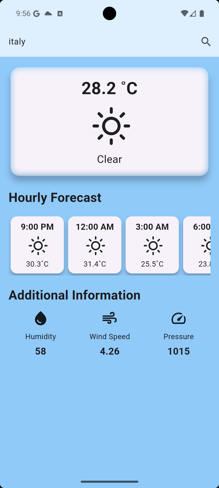
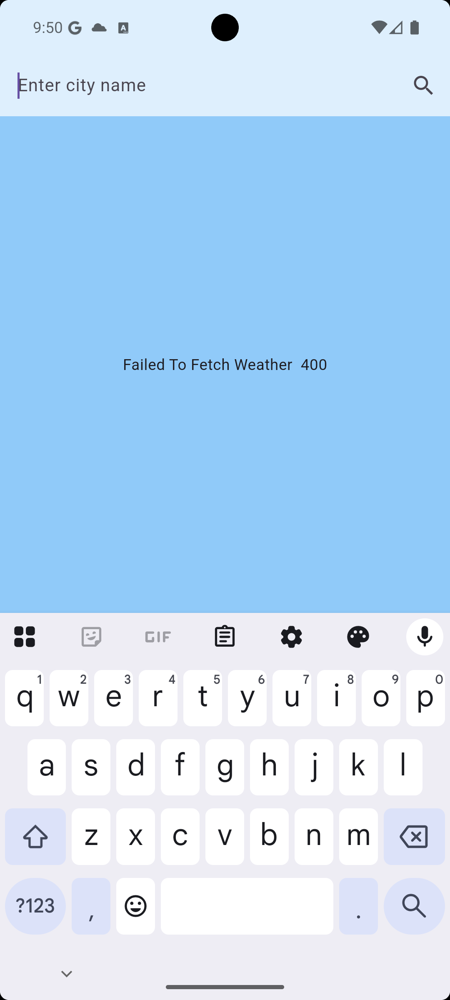
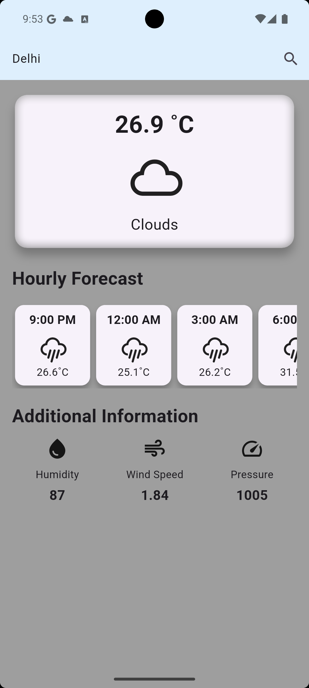

# 🌦️ Weather App (Flutter)

A simple and elegant **Weather App** built using Flutter.  
It fetches live weather data from the **OpenWeather API** and displays current conditions for any city.  

---

## 📸 Screenshots

| Home Screen | Search Result | Weather Background |
|-------------|---------------|---------------------|
|  |  |  |

👉 Place your screenshots in a folder named `screenshots` inside your repo, and update the file names if needed.  
For example:  
```
weather-app/
 ├── lib/
 ├── screenshots/
 │     ├── home.png
 │     ├── search.png
 │     ├── background.png
 └── README.md
```

---

## ✨ Features
- 🌍 Search weather by city name  
- ☁️ Fetch live weather data using OpenWeather API  
- 🎨 Dynamic background that changes with weather condition  
- 📱 Responsive UI with Flutter widgets  

---

## 🛠️ Tech Stack
- [Flutter](https://flutter.dev/) – UI Framework  
- [Dart](https://dart.dev/) – Programming Language  
- [OpenWeather API](https://openweathermap.org/api) – Weather Data  

---

## 🚀 How to Run

1. Clone the repo
   ```bash
   git clone https://github.com/Nigam22/weather-app.git
   ```
2. Navigate to the project folder
   ```bash
   cd weather-app
   ```
3. Get dependencies
   ```bash
   flutter pub get
   ```
4. Run the app
   ```bash
   flutter run
   ```

---

## 🔮 Future Improvements
- Add weekly forecast  
- Add GPS-based location weather  
- Add animations for different weather conditions  

---

## 👨‍💻 Author
- **Your Name**  
  [LinkedIn](https://linkedin.com/in/nigam-rathore) |
